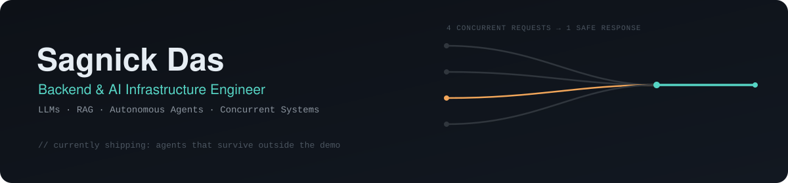

  

  
  
  

 

Final-year CS (Data Science) undergrad who spends more time in Docker configs and request queues than in model weights. I build the layer of AI systems that doesn't show up in the demo — the APIs, containers, and concurrency logic that keep things standing once more than one person hits the endpoint at once.

- 🏗️ Shipped 2 production apps end-to-end (React + FastAPI + infra) — 500+ users, 1,500+ monthly requests, zero-downtime deploys
- 🧪 Also spend time on the adversarial side: LLM red-teaming, jailbreak benchmarking, robustness testing
- 🎓 B.Tech CSE (Data Science), MCKV Institute of Engineering · 2022–2026 · GPA 8.57/10 · 150+ LeetCode solves

 

### Toolbox

**Languages & Backend**

**AI / ML / LLM**

**Data & Infra**

`RAG` `Semantic Search` `Vector DB` `JWT` `RBAC` `Prompt Engineering` `Concurrent Systems`

 

### Featured builds

**LLM & agent systems**

- **[SafeLLMBench](https://github.com/imnick48?tab=repositories)** <!-- swap in the direct SafeLLMBench repo link --> — Open-source LLM safety benchmark: a pip-installable CLI and OpenAI-compatible FastAPI server that red-teams Hugging Face models with a LoRA-tuned adversarial prompt generator. Hit a 48% jailbreak rate on Qwen3-1.7B, scored by a Transformer classifier trained from scratch on 28K+ samples. · `Python` `LoRA` `FastAPI`
- **[CodeGenX](https://github.com/imnick48/CodeGenX)** — An autonomous coding agent (OpenRouter + open models) that reads a codebase and edits 25+ files from a plain-English prompt, keeping project context across sessions via persistent SQLite memory. · `LLM Agents` `SQLite` `Orchestration`
- **[Research Automation Platform](https://github.com/imnick48/ResearchAutomation)** — Multi-stage RAG pipeline that ingests and semantically indexes research papers into ChromaDB, grounding answers in retrieved context at millisecond latency instead of letting the model improvise. · `RAG` `ChromaDB` `LangChain`

**Applied ML & production systems**

- **[Hanarecruit](https://github.com/imnick48/Resume_Scanner)** — ATS-style resume screener that scores and ranks candidates in seconds instead of minutes; containerized and shipped on AWS ECS/ECR/ALB with one-command deploys, cutting screening time from ~3 minutes to ~45 seconds. · `FastAPI` `Docker` `AWS ECS`
- **[Neurodevelopmental Disorder Classifier](https://github.com/imnick48?tab=repositories)** <!-- swap in the direct repo link --> — Multi-architecture classifier (ViT, CNN, LeNet) served through a semaphore-gated concurrent inference pipeline that loads and releases TFLite interpreters on demand, so parallel requests don't blow up memory. · `TensorFlow Lite` `Flask` `Concurrency`
- **[Adversarial ML Malware Defense](https://github.com/imnick48/ADVERSARIAL-MALWARE-EVASION-AND-DEFENSE-ANALYSIS)** — Pushed a malware detector's adversarial robustness from 48% to 79% via adversarial training on 29K+ samples, using hybrid feature selection for an 83% clean-data baseline. · `Adversarial ML` `scikit-learn`

 

### Experience

**Freelance Software Engineer** — Jul 2025 to Sep 2025 
Shipped 2 production React + FastAPI apps end-to-end — DNS, SSL, AWS — for 500+ users; automated content deploys, cutting a 48-hour manual process down to 30 minutes.

**Java Developer Intern**, Ardent Computech Pvt. Ltd. — Jun 2025 to Aug 2025 
Built a full-stack e-commerce platform with role-based access control and Razorpay payments, including webhook handling and failure recovery, plus separate admin and customer portals.

 

### GitHub activity

  
  

 

Open to backend / AI infrastructure roles — the badges up top go straight to my inbox.

